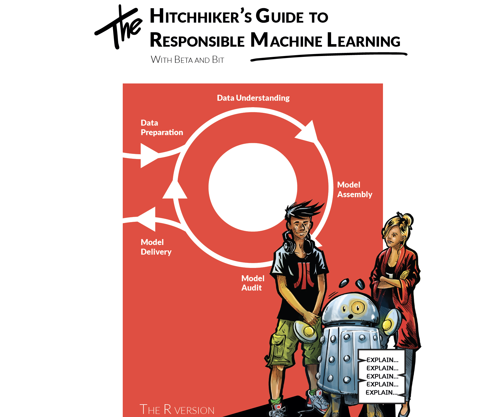

# The Hitchhiker’s Guide to Responsible Machine Learning

This book is a unique entanglement of theory, examples and processes relevant to Responsible Machine Learning. You will find intuitions and examples for Interpretable Machine Learning (IML) and eXplainable Artificial Intelligence (XAI). Descriptions are supplemented by code snippets with examples for R with the use of randomForest, mlr3 and DALEX packages. Finally, the process is shown through a comic book describing the adventures of two characters, Beta and Bit. The interaction of these two shows the decisions that analysts often face, whether to try a different model, try another technique for exploration or look for other data -- questions like how to compare models or validate them.

All examples are fully reproducible so that one can replay all adventures on a local desktop.

Model development is a responsible and challenging task but also an exciting adventure. Sometimes textbooks focus only on the technical side, losing all the fun. Here we are going to have it all.

## Materials 

* Free flipbook: https://betaandbit.github.io/RML/
* Buy pdf version at LeanPub: https://leanpub.com/RML
* Buy printed paper version at LuLu: https://www.lulu.com/shop/anna-kozak-and-przemys%C5%82aw-biecek-and-aleksander-zawada/the-hitchhikers-guide-to-responsible-machine-learning/paperback/product-7nmmmk.html
* Reproducible code snippets: [html](https://htmlpreview.github.io/?https://github.com/BetaAndBit/RML/blob/main/data/modelsXAI.html)
* Reproducible snippets: [Rmd](data/modelsXAI.Rmd)
* Data: [covid_spring.csv](data/covid_spring.csv)
* Data: [covid_summer.csv](data/covid_summer.csv)

Please, note that these are artificial datasets generated to mimic relations present in the real data.

## Other language versions

* Polish: *Wprowadzenie do Modelowania Predykcyjnego* [GitHub](https://github.com/BetaAndBit/MiniML), [flipbook](https://betaandbit.github.io/MiniML/)
* Spanish: *La Guía del Viajero al Aprendizaje Automático Responsable* [GitHub](https://github.com/BetaAndBit/RML_ES), [flipbook](https://betaandbit.github.io/RML_ES/)
* German: *Per Anhalter durch die Galaxis des verantwortungsvollen maschinellen Lernens* [flipbook](https://betaandbit.github.io/RML_DE/), [paperback](https://www.amazon.de/-/en/Przemyslaw-Biecek/dp/8365291185/)
* Turkish: *Sorumlu Makine Öğrenmesi Rehberi* [GitHub](https://github.com/BetaAndBit/RML_TR), [flipbook](https://betaandbit.github.io/RML_TR/)
* Vietnamese: *4.0.1 Cùng xây dựng Model Machine Learning với Bêta và Bít* [GitHub](https://github.com/BetaAndBit/RML_VN), [flipbook](https://betaandbit.github.io/RML_VN/)

## Intro




## Comments

### Dianne Cook


EN: Dianne Cook is Professor of Business Analytics at Monash University in Melbourne, Australia. Her research is in the area of data visualisation, especially the visualisation of high-dimensional data using tours with low-dimensional projections, and projection pursuit. A current focus is on bridging the gap between exploratory graphics and statistical inference.

```
The Hitchhikers Guide to Responsible Machine Learning is a delightful read. I had to flip 
from comic to comic first, which is fun and also on point about not falling into a pit 
of errors when doing machine learning with data. The detailed text explanations and 
beautifully constructed margin figures provide filling to the sandwich. 
Congratulations to Przemek, Anna and Aleksander for a creative and insightful 
contribution to the explainable AI literature.

Di Cook, Hitchhiker in high-dimensional spaces
```

### Marek Stączek

Coach, storyteller, author of books

PL:

```
Dwóch studentów Politechniki Warszawskiej szło łeb w łeb w konkursie ogłoszonym przez NASA. Wygrał Mietek Bekker 
i to jego Lunar Roving Vehicle, w statku Apollo poleciał na księżyc.  Jak rodzą się tacy studenci? Przez kontakt 
z wyjątkowymi nauczycielami. A co charakteryzuje tych drugich? Oryginalny i inspirujący przekaz.

Do Waszych rąk trafia podręcznik profesora Przemysława Biecka, który nawiązuje do takich wzorców.
```

EN:

```
Two students from the Warsaw University of Technology went head to head in a competition announced by NASA. 
Mietek Bekker won, and it was his Lunar Roving Vehicle in the Apollo spacecraft that flew to the moon.  
How are such students born? Through contact with exceptional tutors. And what characterises the latter? 
An original and inspiring delivery.

An exceptional textbook by professor Przemysław Biecek is now in your hands.
```

###  Łukasz Rajkowski

editorial board of Polish popular science monthly Delta


PL:

```
Niniejsza książka jest krótką, lecz pouczającą i wciągającą wycieczką po odpowiedzialnym uczeniu maszynowym, 
w której dokładne wytłumaczenia fundamentalnych koncepcji są umiejętnie wplecione we wdzięczną i atrakcyjnie 
zilustrowaną fabułę. W sposób przyjazny turyście wskazuje ona na pewne ważne aspekty wnioskowania z danych 
oraz pozwala rzucić okiem na to, jak tego typu analizy są (lub przynajmniej powinny być) przeprowadzane. 
Należy zwrócić uwagę, że od Czytelnika nie wymaga się profesjonalnego, podróżniczego ekwipunku - otwarty 
umysł oraz solidne matematyczne przygotowanie na poziomie szkoły średniej z pewnością wystarczą. Nie trzeba 
chyba dodawać, że nie wystarczy powrócić z tej wycieczki aby stać się ekspertem w "data science" - jest to 
wszak ogromna (i fascynująca) dziedzina, która może być porównana do podróży tysiąca mil. Wiemy jednak 
doskonale, że takie podróże rozpoczynają się od pierwszego kroku... lub złapania autostopu!
```

EN:

```
This book is a short but illuminating and entertaining trip to responsible machine learning, in which 
accurate explanations of some fundamental concepts successfully mingle with a pleasant, richly illustrated 
storyline. In a tourist-friendly manner it points out some important aspects of inference from the data 
and gives you a glimpse of how data driven answers are (or at least should be) obtained. Note that no 
professional travelling equipment is required - an open mind and a solid high-school level of mathematical 
abilities will certainly suffice. Needless to say, finishing this tour won't make you an expert in data 
science - a vast and fascinating field which can be compared to a journey of a thousand miles. But we all 
know that such journeys begin with a single step... or a hitchhiker's guide!
```

###  Fernando Marmolejo-Ramos

Research fellow in human and artificial cognition at the Centre for Change and Complexity in Learning at the University of South Australia. 

EN:

```
Data science requires knowledge of the data and the methods to parse such data. A new kid
on the analytical block is gaining popularity among data scientists: machine learning. It is
powerful as it combines long-standing statistical methods with computational versatility. But
as as the ‘Peter Parker principle’ goes ‘with great power comes great responsibility’. Biecek’s
textbook provides a concise tutorial on how to tame the power of machine learning
responsibly. This textbook needs to be read by anyone daring to tickle the power of machine
learning.
```

ES:

```
La ciencia de datos requiere conocimiento de los datos y los métodos para analizar dichos
datos. Un nuevo chico en el bloque analítico está ganando popularidad entre los científicos
de datos: el aprendizaje de máquinas. Es poderoso ya que combina métodos estadísticos
bien establecidos con versatilidad computacional. Pero como dice el &#39;principio de Peter
Parker&#39;, &#39;un gran poder conlleva una gran responsabilidad&#39;. El libro de texto de Biecek
proporciona un tutorial conciso sobre cómo dominar el poder del aprendizaje de máquinas
de manera responsable. Este libro de texto debe ser leído por cualquiera que se atreva a
aprovechar el poder del aprendizaje automático.
```


