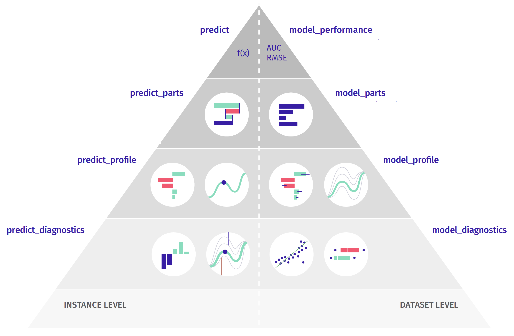

```{r setup, include=FALSE, echo=FALSE}
knitr::opts_chunk$set(echo = TRUE)
```

# *Chapter 1: Predictive modeling*

Get prepared

```
install.packages(c("tableone", "DALEX", "ggplot2", "partykit", "mlr3", "mlr3learners", "ranger", "mlr3tuning", "paradox"))
```

# Part 1: Introduction to predictive modeling + EDA

The purpose of this tutorial is to present a life cycle of a single predictive model for a problem related to binary classification (but I deliberately don't mention logistic regression). Along the way, we will tackle various interesting topics such as model training, model verification, hyperparameter tuning, and exploratory model analysis. 

The examples presented here are inspired by three textbooks books: [The Elements of Statistical Learning](https://www.statlearning.com/) with mathematical foundations, [The mlr3 book](https://mlr3book.mlr-org.com/), presenting software package `mlr3` designed for advanced model programming, [Explanatory Model Analysis](http://ema.drwhy.ai/) overviews methods  for model exploration and visualisation. 
Note that responsible modelling requires knowledge that cannot be learned in two days.  
So, after this introduction, I highly recommend checking out these books.

*Why should I care?*

Predictive models have been used throughout entire human history. Priests in Egypt were predicting when the flood of the Nile or a solar eclipse would come. Developments in statistics, increasing the availability of datasets, and increasing computing power allow predictive models to be built faster and faster.

Today, predictive models are used virtually everywhere. Planning the supply chain for a large corporation, recommending lunch or a movie for the evening, or predicting traffic jams in a city. Newspapers are full of interesting applications.

But how are such predictive models developed? In the following sections, we will go through a life cycle of a  predictive model. From the concept phase, through design, training, checking, to the deployment. 
For this example, we will use the data set on the risk of death for Covid-19 patients after SARS-COV-2 infection.  But keep in mind that the data presented here is artificial. It is generated to mirror relations in real data, but do not contain real observations for real patients.
Still, it should be an interesting use-case to discuss a typical lifetime of a predictive model.

*Tools*

These materials are based on two R packages: `mlr3`  for model training and `DALEX` for model visualization and explanation. But there are more packages with similar functionalities, for modelling other popular choices are `mlr`, `tidymodels` and `caret` while for the model explanation you will find lots of interesting features in `flashlight` and `iml`.


*The problem*

The life cycle of a predictive model begins with a well-defined problem. 
In this example, we are looking for a model that assesses the risk of death after diagnosed covid. We don't want to guess who will survive and who won't. We want to construct a score that allows us to sort patients by risk of death\footnote{For this reason, in the following sections we will use the AUC measure to evaluate models}.

Why do we need such a model? It could have many applications! Those at higher risk of death could be given more protection, such as providing them with pulse oximeters or preferentially vaccinating them. 

## Load packages

```{r, warning=FALSE, message=FALSE}
library("tableone")
library("DALEX")
library("ggplot2")
library("partykit")
library("mlr3")
library("mlr3learners")
library("ranger")
library("mlr3tuning")
library("paradox")

set.seed(1313)
```

## Conception

Before we build any model, even before we touch any data we should first determine for what purpose we will build a predictive model.

It is very important to define the objective before we sit down to programming, because later it is easy to get lost in setting function parameters and dealing with all these details that we need to do. It is easy to lose sight of the long-term goal.

So, first: Define the objective.

For the purpose of these exercises, I have selected data on the covid pandemic. Imagine that we want to determine the order of vaccination.
In this example we want to create a predictive model that assesses individual risks because we would like to rank patients according to their risk. 

To get a model that gives a best ranking we will use the AUC measure to evaluate model performance. What exactly the AUC is I'll talk about a little later, right now the key thing is that we're interested in ranking of patients based on their risk score.

## Read the data

To build a model we need good data. In Machine Learning, the word *good* means a large amount of representative data. Collecting representative data is not easy and often requires designing an appropriate experiment.

The best possible scenario is that one can design and run an experiment to collect the necessary data. In less comfortable situations, we look for "natural experiments," i.e., data that have been collected for another purpose but that can be used to build a model. Here we will use the data= collected through epidemiological interviews. There will be a lot of data points and it should be fairly representative, although unfortunately it only involves symptomatic patients who are tested positive for SARS-COV-2.


For the purposes of this exercise, I have prepared two sets of characteristics of patients infected with covid. It is important to note that these are not real patient data.  This is simulated data, generated to have relationships consistent with real data (obtained from NIH), but the data itself is not real. Fortunately, they are sufficient for the purposes of our exercise.


The data is divided into two sets `covid_spring` and `covid_summer`. The first is acquired in spring 2020 and will be used as training data while the second dataset is acquired in summer and will be used for validation. In machine learning, model validation is performed on a separate data set. This controls the risk of overfitting an elastic model to the data. If we do not have a separate set then it is generated using cross-validation, out of sample or out of time techniques.


- `covid_spring.csv` corresponds to covid mortality data from spring 2020. We will use this data for model training.
- `covid_summer.csv` corresponds to covid mortality data from summer 2020. We will use this data for model validation.


```{r, warning=FALSE, message=FALSE}
covid_spring <- read.table("covid_spring.csv", sep =";", header = TRUE, stringsAsFactors = TRUE)
covid_summer <- read.table("covid_summer.csv", sep =";", header = TRUE, stringsAsFactors = TRUE)
```

## Explore the data

Before we start any serious modeling, it is worth looking at the data first. To do this, we will do a simple EDA. In R there are many tools to do data exploration, I value packages that support so called table one.

```{r, warning=FALSE, message=FALSE}
library("tableone")

table1 <- CreateTableOne(vars = colnames(covid_spring)[1:11],
                         data = covid_spring,
                         strata = "Death")
print(table1)
```

During modeling, exploration often takes the most time. In this case, we will limit ourselves to some simple graphs.

```{r, warning=FALSE, message=FALSE}
ggplot(covid_spring, aes(Age)) +
  geom_histogram() +
  ggtitle("Histogram of age")

ggplot(covid_spring, aes(Age, fill = Death)) +
  geom_histogram() +
  ggtitle("Histogram of age")

ggplot(covid_spring, aes(Age, fill = Death)) +
  geom_histogram(color = "white") +
  ggtitle("Histogram of age") + 
  DALEX::theme_ema() +
  scale_fill_manual("", values = c("grey", "red3"))

library(ggmosaic)
ggplot(data = covid_spring) + 
  geom_mosaic(aes(x=product(Diabetes), fill = Death)) + 
  DALEX::theme_ema() +
  scale_fill_manual("", values = c("grey", "red3"))


```

```{r, warning=FALSE, message=FALSE, fig.width=8, fig.height=12}
library("pheatmap")
pheatmap((covid_spring[,3:11] == "Yes") + 0)

```

## Transform the data

One of the most important rules to remember when building a predictive model is: Do not condition on future! 

Variables like `Hospitalization` or `Cough` are not good predictors, beacuse they are not known in advance.

```{r, warning=FALSE, message=FALSE}
covid_spring <- covid_spring[,c("Gender", "Age", "Cardiovascular.Diseases", "Diabetes",
               "Neurological.Diseases", "Kidney.Diseases", "Cancer",
               "Death")]
covid_summer <- covid_summer[,c("Gender", "Age", "Cardiovascular.Diseases", "Diabetes",
               "Neurological.Diseases", "Kidney.Diseases", "Cancer",
               "Death")]
```

## Your turn

- Plot Age distribution for `covid_spring` and `covid_summer`.
- Calculate `tableone` for `covid_spring` and `covid_summer`.
- (extra) In the `DALEX` package you will find `titanic_imputed` dataset. Calculate `tableone` for this dataset.

# Part 2: Hello model! First predictive model + How to measure performance

We will think of a predictive model as a function that computes a certain prediction for certain input data. Usually, such a function is built automatically based on the data. But technically the model can be any function defined in any way. The first model will be based on statistics collected by the CDC (CDC stands for Centers for Disease Control and Prevention. You will find a set of useful statistics related to Covid mortality on [this page]({https://tinyurl.com/CDCmortality)) that determine mortality in different age groups.


In many cases, you do not need data to create a model. Just google some information about the problem.

It turns out that CDC has some decent statistics about age-related mortality. These statistics will suffice as a first approximation of our model.

https://www.cdc.gov/coronavirus/2019-ncov/covid-data/investigations-discovery/hospitalization-death-by-age.html

*Lesson 1:* Often you don't need individual data to build a good model.

## Create a model

What is a predictive model? We will think of it as a function that takes a set of numbers as input and returns a single number as the result - the score.

```{r, warning=FALSE, message=FALSE}
cdc_risk <- function(x, base_risk = 0.00003) {
  multip <- rep(7900, nrow(x))
  multip[which(x$Age < 84.5)] <- 2800
  multip[which(x$Age < 74.5)] <- 1100
  multip[which(x$Age < 64.5)] <- 400
  multip[which(x$Age < 49.5)] <- 130
  multip[which(x$Age < 39.5)] <- 45
  multip[which(x$Age < 29.5)] <- 15
  multip[which(x$Age < 17.5)] <- 1
  multip[which(x$Age < 4.5)]  <- 2
  multip * base_risk
}
x <- data.frame(Age = 25, Hospitalisation = "Yes")
cdc_risk(x)


library("DALEX")
model_cdc <-  DALEX::explain(cdc_risk,
                   predict_function = function(m, x) m(x),
                   type  = "classification",
                   label = "CDC")
predict(model_cdc, x)

```

The same function can be written in a slightly more compact form as (now it works on many rows)

```{r, warning=FALSE, message=FALSE}
cdc_risk <- function(x, base_risk = 0.00003) {
  bin <- cut(x$Age, c(-Inf, 4.5, 17.5, 29.5, 39.5, 49.5, 64.5, 74.5, 84.5, Inf))
  relative_risk <- c(2, 1, 15, 45, 130, 400, 1100, 2800, 7900)[as.numeric(bin)] 
  relative_risk * base_risk
}

# check it
x <- data.frame(Age = c(25,45,85))
cdc_risk(x)

summary(cdc_risk(covid_spring))

table(Death = covid_spring$Death, 
      Prediction.above.005 = cdc_risk(covid_spring) > 0.05)
```

## Wrap the model 


In R, we have many tools for creating models. The problem with them is that these tools are created by different people and return results in different structures. So in order to work uniformly with the models we need to package the model in such a way that it has a uniform interface.

Different models have different APIs. 

But you need One API to Rule Them All!

The DALEX library provides a unified architecture to explore and validate models using different analytical methods. 

[More info](http://ema.drwhy.ai/do-it-yourself.html#infoDALEX)

```{r, warning=FALSE, message=FALSE}
library("DALEX")
model_cdc <-  DALEX::explain(cdc_risk,
                   predict_function = function(m, x) m(x),
                   data  = covid_summer,
                   y     = covid_summer$Death == "Yes",
                   type  = "classification",
                   label = "CDC")
predict(model_cdc, x)
```

## Model performance

The evaluation of the model performance for the classification is based on different measures than for the regression.

For regression, commonly used measures are Mean squared error MSE

$$MSE(f) = \frac{1}{n} \sum_{i}^{n} (f(x_i) - y_i)^2 $$ 

and Rooted mean squared error RMSE

$$RMSE(f) = \sqrt{MSE(f, X, y)} $$ 

For classification, commonly used measures are Accuracy

$$ACC(f) = (TP + TN)/n$$

Precision

$$Prec(f) = TP/(TP + FP)$$ 

and Recall

$$Recall(f) = TP/(TP + FN)$$ 

and F1 score

$$F1(f) = 2\frac{Prec(f)  * Recall(f) }{Prec(f)  + Recall(f)}$$ 

In this problem we are interested in ranking of scores, so we will use the AUC measure (the area under the ROC curve).

There are many measures for evaluating predictive models and they are located in various R packages (`ROCR`, `measures`, `mlr3measures`, etc.). For simplicity, in this example, we use only the AUC measure from the `DALEX` package.


Pregnancy: Sensitivity and Specificity

http://getthediagnosis.org/diagnosis/Pregnancy.htm

https://en.wikipedia.org/wiki/Sensitivity_and_specificity

For AUC the `cutoff` does not matter. But we set it to get nice precision and F1.

[More info](http://ema.drwhy.ai/modelPerformance.html#modelPerformanceMethodBin)

*Model performance*

Model exploration starts with an assessment of how good is the model.  The `DALEX::model_performance` function calculates a set of the most common measures for the specified model.


```{r, warning=FALSE, message=FALSE}
library("DALEX")
model_cdc <-  DALEX::explain(cdc_risk,
                   predict_function = function(m, x) m(x),
                   type  = "classification",
                   label = "CDC")
predict(model_cdc, x)

model_cdc <-  update_data(model_cdc,
                   data  = covid_summer[,-8],
                   y     = covid_summer$Death == "Yes")
predict(model_cdc, x)

#library(ROCR)
mp_cdc <- model_performance(model_cdc, cutoff = 0.1)
mp_cdc
```

### ROC


Note:  The model is evaluated on the data given in the explainer. Use `DALEX::update_data()` to specify another dataset.

Note:  Explainer knows whether the model is for classification or regression, so it automatically selects the right measures. It can be overridden if needed.

The S3 generic `plot` function draws a graphical summary of the model performance. With the `geom` argument, one can determine the type of chart.


[More info](http://ema.drwhy.ai/modelPerformance.html#fig:exampleROC)

```{r, warning=FALSE, message=FALSE, fig.width=3, fig.height=3}
plot(mp_cdc, geom = "roc") + DALEX::theme_ema() 
```

### LIFT

[More info](http://ema.drwhy.ai/modelPerformance.html#fig:examplePRC)

```{r, warning=FALSE, message=FALSE, fig.width=3, fig.height=3}
plot(mp_cdc, geom = "lift")
```

```{r, warning=FALSE, message=FALSE, fig.width=3, fig.height=3}
plot(mp_cdc, geom = "boxplot")
```

## Your turn

- Calcualte the AUC for CDC model on the `covid_spring` data. 
- Plot ROC for both `covid_spring` and `covid_summer` data.
- (extra) In the `DALEX` package you will find `titanic_imputed` dataset. Build a similar model to CDC but for the Titanic dataset. How good is your model?

# Part 3: Basics of decision tree and random forest 


Usually, we don't know which function is the best for our problem. This is why we want to use data to find/train such function with the use of some automated algorithm.

In the Machine Learning, there are hundreds of algorithms available. Usually, this training boils down to finding parameters for some family of models. One of the most popular families of models is decision trees. Their great advantage is the transparency of their structure.

We will begin building the model by constructing a decision tree. We will stepwise control the complexity of the model.

[More info](https://cran.r-project.org/web/packages/partykit/vignettes/ctree.pdf)

```{r, warning=FALSE, message=FALSE, fig.width=9, fig.height=5}
library("partykit")

tree1 <- ctree(Death ~., covid_spring, 
              control = ctree_control(maxdepth = 1))
plot(tree1)

tree2 <- ctree(Death ~., covid_spring, 
              control = ctree_control(maxdepth = 2))
plot(tree2)

tree3 <- ctree(Death ~., covid_spring, 
              control = ctree_control(maxdepth = 3))
plot(tree3)


tree <- ctree(Death ~., covid_spring, 
              control = ctree_control(alpha = 0.0001))
plot(tree)
```

To work with different models uniformly, we will also wrap this one into an explainer.

```{r, warning=FALSE, message=FALSE}
model_tree <-  DALEX::explain(tree,
                   predict_function = function(m, x) predict(m, x, type = "prob")[,2],
                   data = covid_summer[,-8],
                   y = covid_summer$Death == "Yes",
                   type = "classification",
                   label = "Tree",
                   verbose = FALSE)
```


### Test your model

```{r, warning=FALSE, message=FALSE}
mp_tree <- model_performance(model_tree, cutoff = 0.1)
mp_tree
plot(mp_tree, geom = "roc")

hist(predict(model_tree, covid_summer))

plot(mp_tree, mp_cdc, geom = "roc")
```

### Your turn

- Check the AUC for CDC model on the `covid_spring` data. 
- Plot ROC for both `covid_spring` and `covid_summer` data.
- (*)Try to overfit.


Example for titanic

```
head(titanic_imputed)
tree <- ctree(survived ~., titanic_imputed)
plot(tree)

tree <- ctree(factor(survived) ~., titanic_imputed, 
              control = ctree_control(alpha = 0.0001))
plot(tree)

model_tree <-  DALEX::explain(tree,
                   predict_function = function(m, x) predict(m, x, type = "prob")[,2],
                   data = titanic_imputed,
                   y = titanic_imputed$survived == 1,
                   type = "classification",
                   label = "Tree",
                   verbose = FALSE)
mp <- model_performance(model_tree)
mp
plot(mp, geom = "roc")
```

## Plant a forest

Decision trees are models that have low bias but high variance. In 2001, Leo Breiman proposed a new family of models, called a random forest, which averages scores from multiple decision trees trained on bootstrap samples of the data. The whole algorithm is a bit more complex but also very fascinating. You can read about it at https://tinyurl.com/RF2001. Nowadays a very popular, in a sense complementary technique for improving models is boosting, in which you reduce the model load at the expense of variance. This algorithm reduces variance at the expense of bias. Quite often it leads to a better model.

We will train a random forest with the `mlr3` library. The first step is to define the prediction task.
[More info](https://mlr3book.mlr-org.com/tasks.html)

```{r bagging_tree, warning=FALSE, message=FALSE}
library("mlr3")

covid_task <- TaskClassif$new(id = "covid_spring",
                             backend = covid_spring,
                             target = "Death",
                             positive = "Yes")
covid_task
```

Now we need to define the family of models in which we want to look for a solution. The random forests is specified by the `classif.ranger"` parameter. To find the best model in this family we use the `train()`.

[More info](https://mlr3book.mlr-org.com/learners.html)

```{r, warning=FALSE, message=FALSE}
library("mlr3learners")
library("ranger")

covid_ranger <- lrn("classif.ranger", predict_type = "prob",
                num.trees = 25)
covid_ranger

covid_ranger$train(covid_task)
covid_ranger$model
predict(covid_ranger, covid_summer[1:3,], predict_type = "prob")[,1]

```

### Test your model

A trained model can be turned into an explainer. Simpler functions can be used to calculate the performance of this model. But using explainers has an advantage that will be seen in all its beauty in just two pages. 

```{r, warning=FALSE, message=FALSE}
model_ranger <-  explain(covid_ranger,
                           predict_function = function(m,x)
                                predict(m, x, predict_type = "prob")[,1],
                           data = covid_summer[,-8],
                           y = covid_summer$Death == "Yes",
                           type = "classification",
                           label = "Ranger",
                           verbose = FALSE)

mp_ranger <- model_performance(model_ranger)
mp_ranger
plot(mp_ranger, geom = "roc")

plot(mp_ranger, mp_tree, mp_cdc, geom = "roc")
```

## Your turn

- Check the AUC for Ranger model on the `covid_spring` data. 
- Plot ROC for both `covid_spring` and `covid_summer` data.
- (extra) In the `DALEX` package you will find `titanic_imputed` dataset. Build a tree based model for the Titanic dataset. How good is your model?

# Part 4: Hyperparameter optimization + Wrap-up 

*Hyperparameter Optimisation*

Machine Learning algorithms typically have many hyperparameters that determine how the model is to be trained. For models with high variance, the selection of such hyperparameters has a strong impact on the quality of the final solution. The mlr3tuning package contains procedures to automate the process of finding good hyperparameters.

See: https://mlr3book.mlr-org.com/tuning.html.

To use it, you must specify the space of hyperparameter to search. Not all hyperparameters are worth optimizing. In the example below, we focus on four for the random forest algorithm.

## Automated Hyperparameter Optimisation

For automatic hyperparameter search, it is necessary to specify a few more elements: (1) a stopping criterion, below it is the number of 10 evaluations, (2) a search strategy for the parameter space, below it is a random search, (3) a way to evaluate the performance of the proposed models, below it is the AUC determined by 5-fold cross-validation.

### Define the search space

In order to be able to automatically search for optimal parameters, it is first necessary to specify what is the space of possible hyperparameters.

[More info](https://mlr3book.mlr-org.com/searchspace.html)

```{r, warning=FALSE, message=FALSE}
library("mlr3tuning")
library("paradox")

covid_ranger$param_set

search_space = ps(
  num.trees = p_int(lower = 50, upper = 500),
  max.depth = p_int(lower = 1, upper = 10),
  mtry = p_int(lower = 1, upper = 7),
  minprop = p_dbl(lower = 0.01, upper = 0.1),
  splitrule = p_fct(levels = c("gini", "extratrees"))
)
search_space
```

### Set-up the tuner

Popular searching strategies are `random_search` and `grid_search`.
Termination is set fo a specific number of evaluations.
Internal testing is based on 5-fold CV.

[More info](https://mlr3book.mlr-org.com/tuning.html#autotuner)

```{r, warning=FALSE, message=FALSE}
tuned_ranger = AutoTuner$new(
  learner    = covid_ranger,
  resampling = rsmp("cv", folds = 5),
  measure    = msr("classif.auc"),
  search_space = search_space,
  terminator = trm("evals", n_evals = 10),
  tuner    = tnr("random_search")
)
tuned_ranger
```

### Tune

```{r, warning=FALSE, message=FALSE, results='hide'}
tuned_ranger$train(covid_task)
```
```{r, warning=FALSE, message=FALSE}
tuned_ranger$tuning_result
tuned_ranger$predict_newdata(newdata = covid_spring)$prob[1:4,]
```

### Test your model

```{r, message=FALSE, warning=FALSE}
model_tuned <-  explain(tuned_ranger,
                           predict_function = function(m,x)
                               m$predict_newdata(newdata = x)$prob[,1],
                           data = covid_summer[,-8],
                           y = covid_summer$Death == "Yes",
                           type = "classification",
                           label = "AutoTune",
                           verbose = FALSE)

mp_tuned <- model_performance(model_tuned)
mp_tuned
plot(mp_tuned, geom = "roc")

plot(mp_ranger, mp_tree, mp_cdc, mp_tuned, geom = "roc")
```

### Sum up

```{r, message=FALSE, warning=FALSE}
do.call(rbind, 
        list(cdc   = mp_cdc$measures,
            tree   = mp_tree$measures,
            ranger = mp_ranger$measures,
            tuned  = mp_tuned$measures))
```
### Your turn

- Check the AUC for AutoTune model on the `covid_spring` data. 
- Plot ROC for both `covid_spring` and `covid_summer` data.
- (extra) In the `DALEX` package you will find `titanic_imputed` dataset. Optimize a tree based model for the Titanic dataset. How good is your model?


# *Chapter 2: Model exploration*

We will devote the second day entirely to talking about methods for model exploration. 

[More info](http://ema.drwhy.ai/modelLevelExploration.html)



# Part 1: Model level analysis - variable importance


Some models have built-in methods for assessment of Variable importance. For linear models one can use standardized model coefficients or p-values. For random forest one can use out-of-bag classification error. For tree boosting models one can use gain statistics. Yet, problem with such measures is that not all models have build-in variable importance statistics (e.g. neural networks) and that scores between differetnt models cannot be directly compared (how to compare gains with p-values).

This is why we need a model agnostic approach that will be comparable between different models. The procedure described below is universal, model agnostic and does not depend on the model structure.

The procedure is based on variable perturbations in the validation data. If a variable is important in a model, then after its permutation the model predictions should be less accurate. 

The permutation-based variable-importance of a variable $i$ is the difference between the model performance for the original data and the model performance measured on data with the permutated variable $i$

$$
VI(i) = L(f, X^{perm(i)}, y) - L(f, X, y)
$$

where
$L(f, X, y)$ is the value of loss function for original data $X$, true labels $y$ and model $f$, while $X^{perm(i)}$ is dataset $x$ with $i$-th variable permutated.


Which performance measure should you choose? It's up to you. In the `DALEX` library, by default, RMSE is used for regression and 1-AUC for classification problems. But you can change the loss function by specifying the \verb:loss_function: argument.

[More info](http://ema.drwhy.ai/featureImportance.html)

```{r, message=FALSE, warning=FALSE, fig.width=6, fig.height=3}
mpart_ranger <- model_parts(model_ranger)
mpart_ranger
plot(mpart_ranger, show_boxplots = FALSE, bar_width=4) +
  DALEX:::theme_ema_vertical() + 
  theme( axis.text = element_text(color = "black", size = 12, hjust = 0)) +
  ggtitle("Variable importance","")
```
```{r, message=FALSE, warning=FALSE, fig.width=6, fig.height=3}
mpart_ranger <- model_parts(model_ranger, type = "difference")
mpart_ranger
plot(mpart_ranger, show_boxplots = FALSE, bar_width=4) +
  DALEX:::theme_ema_vertical() + 
  theme( axis.text = element_text(color = "black", size = 12, hjust = 0)) +
  ggtitle("Variable importance","")
```

```{r, message=FALSE, warning=FALSE, fig.width=6, fig.height=7}
mpart_cdc <- model_parts(model_cdc)
mpart_tree <- model_parts(model_tree)
mpart_ranger <- model_parts(model_ranger)
mpart_tuned <- model_parts(model_tuned)

plot(mpart_cdc, mpart_tree, mpart_ranger, mpart_tuned, show_boxplots = FALSE, bar_width=4) +
  DALEX:::theme_ema_vertical() + 
  theme( axis.text = element_text(color = "black", size = 12, hjust = 0)) +
  ggtitle("Variable importance","") +
  facet_wrap(~label, ncol = 2, scales = "free_y")

plot(mpart_cdc, mpart_tree, mpart_ranger, mpart_tuned, show_boxplots = FALSE, bar_width=4) +
  DALEX:::theme_ema_vertical() + 
  theme( axis.text = element_text(color = "black", size = 12, hjust = 0)) +
  ggtitle("Variable importance","")
```

## Your turn

- Compare results for `covid_summer` with results on the `covid_spring` data.
- (extra) In the `DALEX` package you will find `titanic_imputed` dataset. Train a ranger model and calculate variable importance.

# Part 2: Model level analysis - variable profile

Partial dependence profiles are averages from CP profiles for all (or a large enough number) observations.

The `model_profiles()` function calculates PD profiles for a~specified model and variables (all by default). 

[More info](http://ema.drwhy.ai/partialDependenceProfiles.html)

```{r, message=FALSE, warning=FALSE}
mprof_cdc <- model_profile(model_cdc, "Age")
plot(mprof_cdc)

mgroup_ranger <- model_profile(model_ranger, variable_splits = list(Age = 0:100))
plot(mgroup_ranger)+
  DALEX:::theme_ema() + 
  theme( axis.text = element_text(color = "black", size = 12, hjust = 0)) +
  ggtitle("PD profile","")
```

*Grouped partial dependence profiles*


By default, the average is calculated for all observations. But with the argument `groups=` one can specify a factor variable in which CP profiles will be averaged. 

```{r, message=FALSE, warning=FALSE}
mgroup_ranger <- model_profile(model_ranger, variable_splits = list(Age = 0:100), groups = "Diabetes")
plot(mgroup_ranger)+
  DALEX:::theme_ema() + 
  theme( axis.text = element_text(color = "black", size = 12, hjust = 0)) +
  ggtitle("PD profiles for groups","") + ylab("") + theme(legend.position = "top")


mgroup_ranger <- model_profile(model_ranger, variable_splits = list(Age = 0:100), groups = "Cardiovascular.Diseases")
plot(mgroup_ranger)+
  DALEX:::theme_ema() + 
  theme( axis.text = element_text(color = "black", size = 12, hjust = 0)) +
  ggtitle("PDP variable profile","") + ylab("") + theme(legend.position = "top")

mgroup_ranger <- model_profile(model_ranger, "Age", k = 3, center = TRUE)
plot(mgroup_ranger)+
  DALEX:::theme_ema() + 
  theme( axis.text = element_text(color = "black", size = 12, hjust = 0)) +
  ggtitle("PD profiles for segments","")

mgroup_ranger <- model_profile(model_ranger, "Age", groups = "Cardiovascular.Diseases")
plot(mgroup_ranger)+
  DALEX:::theme_ema() + 
  theme( axis.text = element_text(color = "black", size = 12, hjust = 0)) +
  ggtitle("Variable profile","")

mgroup_ranger <- model_profile(model_ranger, variable_splits = list(Age = 0:100), groups = "Cardiovascular.Diseases")
plot(mgroup_ranger, geom = "profiles")
plot(mgroup_ranger, geom = "points")
```

```{r, message=FALSE, warning=FALSE}
mprof_cdc <- model_profile(model_cdc, variable_splits = list(Age=0:100))
mprof_tree <- model_profile(model_tree, variable_splits = list(Age=0:100))
mprof_ranger <- model_profile(model_ranger, variable_splits = list(Age=0:100))
mprof_tuned <- model_profile(model_tuned, variable_splits = list(Age=0:100))
```

Profiles can be then drawn with the `plot()` function. 

```{r, message=FALSE, warning=FALSE}
plot(mprof_tuned, mprof_cdc, mprof_tree, mprof_ranger) +
  ggtitle("","") +
  DALEX:::theme_ema() + 
  theme( axis.text = element_text(color = "black", size = 12, hjust = 0), legend.position = "top")
```

If the model is additive, all CP profiles are parallel. But if the model has interactions, CP profiles may have different shapes for different observations. Defining the k argument allows to find and calculate the average in k segments of CP profiles.


PDP profiles do not take into account the correlation structure between the variables. For correlated variables, the Ceteris paribus assumption may not make sense. The `model_profile` function can also calculate other types of aggregates, such as marginal profiles and accumulated local profiles. To do this, specify the argument `type=` for `"conditional"` or `"accumulated"`.

## Your turn

- Compare results for `covid_summer` with results on the `covid_spring` data.
- (extra) In the `DALEX` package you will find `titanic_imputed` dataset. Train a ranger model and plot variable profiles.

# Part 3: Instance level analysis - variable attributions

Once we calculate the model prediction, the question often arises which variables had the greatest impact on it.

For linear models it is easy to assess the impact of individual variables because there is one coefficient for each variable.

[More info](http://ema.drwhy.ai/InstanceLevelExploration.html)

```{r}
Steve <- data.frame(Gender = factor("Male", c("Female", "Male")),
       Age = 76,
       Cardiovascular.Diseases = factor("Yes", c("No", "Yes")), 
       Diabetes = factor("No", c("No", "Yes")), 
       Neurological.Diseases = factor("No", c("No", "Yes")), 
       Kidney.Diseases = factor("No", c("No", "Yes")), 
       Cancer = factor("No", c("No", "Yes")))
predict(model_ranger, Steve)
Steve
```

It turns out that such attributions can be calculated for any predictive model. The most popular model agnostic method is Shapley values.
They may be calculated with a `predict_parts()` function.

[More info](http://ema.drwhy.ai/shapley.html)

```{r, message=FALSE, warning=FALSE, fig.width=6, fig.height=2.5}
ppart_cdc <- predict_parts(model_cdc, Steve, type = "shap")
plot(ppart_cdc)

ppart_tree <- predict_parts(model_tree, Steve, type = "shap")
plot(ppart_tree)

ppart_tree <- predict_parts(model_tree, Steve)
plot(ppart_tree)


ppart_ranger <- predict_parts(model_ranger, Steve, type = "shap")
pl1 <- plot(ppart_ranger) + ggtitle("Shapley values for Ranger")+
  DALEX:::theme_ema_vertical() + 
  theme( axis.text = element_text(color = "black", size = 12, hjust = 0))

ppart_ranger <- predict_parts(model_ranger, Steve)
pl2 <- plot(ppart_ranger) + ggtitle("Break-down for Ranger")+
  DALEX:::theme_ema_vertical() + 
  theme( axis.text = element_text(color = "black", size = 12, hjust = 0))

library("patchwork")
pl1 + (pl2 + scale_y_continuous("prediction", limits = c(0,0.4)))

ppart_ranger <- predict_parts(model_ranger, Steve,
                    keep_distributions = TRUE)
plot(ppart_ranger, plot_distributions = TRUE) + ggtitle("Consecutive conditoning for Ranger")+
  DALEX:::theme_ema_vertical() + 
  theme( axis.text = element_text(color = "black", size = 12, hjust = 0))


ppart_tuned <- predict_parts(model_tuned, Steve, type = "shap")
plot(ppart_tuned)
```

The `show_boxplots` argument allows you to highlight the stability bars of the estimated attributions.

Other possible values of the `type` argument are `oscillations`, `shap`,  `break_down`, `break_down_interactions`.

With `order`  one can force a certain sequence of variables.

By default, functions such as `model_parts`, `predict_parts`, `model_profiles` do not calculate statistics on the entire data set, but on `n_samples` of random cases, and the entire procedure is repeated `B` times to estimate the error bars.


```{r, message=FALSE, warning=FALSE, fig.width=6, fig.height=2.5}
ppart_cdc <- predict_parts(model_cdc, Steve)
plot(ppart_cdc)
```


```{r, message=FALSE, warning=FALSE, fig.width=6, fig.height=2.5}
ppart_tuned <- predict_parts(model_tuned, Steve)
plot(ppart_tuned)
```

## Your turn

- Compare results for `covid_summer` with results on the `covid_spring` data.
- (extra) In the `DALEX` package you will find `titanic_imputed` dataset. Train a ranger model and calculate local variable attribution.

# Part 4: Instance level analysis - variable profile + Wrap-up

*Profile for a single prediction*

Ceteris Paribus is a Latin phrase for "other things being equal.

Ceteris-paribus profiles  show how the model response would change for a~selected observation if one of the coordinates of that observation were changed while leaving the other coordinates unchanged.

The `predict_profiles()` function calculated CP profiles for a selected observation, model and vector of variables (all continuous variables by default). 


[More info](http://ema.drwhy.ai/ceterisParibus.html)

```{r, message=FALSE, warning=FALSE}
mprof_cdc <- predict_profile(model_cdc, Steve, "Age")
plot(mprof_cdc)
```

CP profiles can be visualized with the generic  \verb'plot()' function.

For technical reasons, quantitative and qualitative variables cannot be shown in a single chart. So if you want to show the importance of quality variables you need to plot them separately.


```{r, message=FALSE, warning=FALSE}
mprof_cdc <- predict_profile(model_cdc, variable_splits = list(Age=0:100), Steve)
mprof_tree <- predict_profile(model_tree, variable_splits = list(Age=0:100), Steve)
mprof_ranger <- predict_profile(model_ranger, variable_splits = list(Age=0:100), Steve)
mprof_tuned <- predict_profile(model_tuned, variable_splits = list(Age=0:100), Steve)

plot(mprof_tuned)

plot(mprof_tuned, mprof_cdc, mprof_tree, mprof_ranger)


mprof_tuned <- predict_profile(model_tuned, variables = "Age", Steve)
pl1 <- plot(mprof_tuned) + ggtitle("Ceteris paribus for Ranger")+
  DALEX:::theme_ema() + scale_y_continuous("prediction", limits = c(0,0.55)) +
  theme( axis.text = element_text(color = "black", size = 12, hjust = 0))

mprof_tuned2 <- predict_profile(model_tuned, variables = "Cardiovascular.Diseases", Steve)
pl2 <- plot(mprof_tuned2, variable_type = "categorical", variables = "Cardiovascular.Diseases", categorical_type = "lines")  + ggtitle("Ceteris paribus for Ranger")+
  DALEX:::theme_ema() +  scale_y_continuous("prediction", limits = c(0,0.55)) +
  theme( axis.text = element_text(color = "black", size = 12, hjust = 0))

pl1 + pl2

plot(mprof_tuned, mprof_cdc, mprof_tree, mprof_ranger) + ggtitle("Ceteris paribus for Steve")+
  DALEX:::theme_ema() + 
  theme( axis.text = element_text(color = "black", size = 12, hjust = 0))

```

Local importance of variables can be measured as oscillations of CP plots. The greater the variability of the CP profile, the more important is the variable. Set `type = "oscillations"` in the `predict_parts` function.


## Your turn

- Compare results for `covid_summer` with results on the `covid_spring` data.
- (extra) In the `DALEX` package you will find `titanic_imputed` dataset. Train a ranger model and calculate local profiles.

# Extras

Play with your model!

[More info](https://github.com/ModelOriented/modelStudio/blob/master/README.md)

```{r, eval=FALSE}
library("modelStudio")

ms <- modelStudio(model_ranger, new_observation = Steve)
ms

library("arenar")
library("dplyr")

rownames(Steve) = c("Steve")

covid_ar <- create_arena(live = TRUE) %>%
    push_model(model_cdc) %>%
    push_model(model_tree) %>%
    push_model(model_ranger) %>%
    push_model(model_tuned) %>%
    push_observations(Steve) 
run_server(covid_ar)

```

# Session info

```{r, warning=FALSE, message=FALSE}
devtools::session_info()
```

